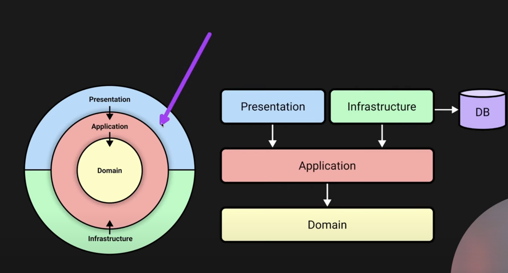

# Nest Clean Architecture Stater

## Overview

This project provides a foundational structure for building RESTful APIs using NestJS, leveraging Prisma for object-relational mapping (ORM) and for database migrations. It adheres to Domain-Driven Design (DDD) principles for optimal code organization and maintainability.

## Features

- 🚀 Nestjs: High-performance, asynchronous web framework for building APIs.
- 🛡️ Prisma: Robust ORM for interacting with databases.
- 🛠️ Biome: An extremely fast javascript linter and code formatter, written in Rust.
- 💈 Husky: A framework for managing and maintaining multi-language pre-commit hooks.
- 🚢 Bun: Node packaging manager

## Setup

- Ensure you have Bun on your system. To set up the project environment, run the following command:

```bash
bun install
```

## How to start project

- To start the development server, use the following command:

```bash
bun start:dev
```

## Script

- All necessary scripts for this project are listed in the Makefile. Please carefully review the Makefile and execute the desired script accordingly.

## Structure

The project follows Domain-Driven Design principles, with the following directory structure:

- presentation: Handles incoming requests and outgoing responses.
- application: Orchestrates business logic, coordinates domain objects
- domain: Defines the domain model and business entities.
- infrastructure: Manages external dependencies like databases and messaging systems.
- core: Contains shared utilitie, constants, configurations, and other cross-cutting concerns.



## Repo Activity


